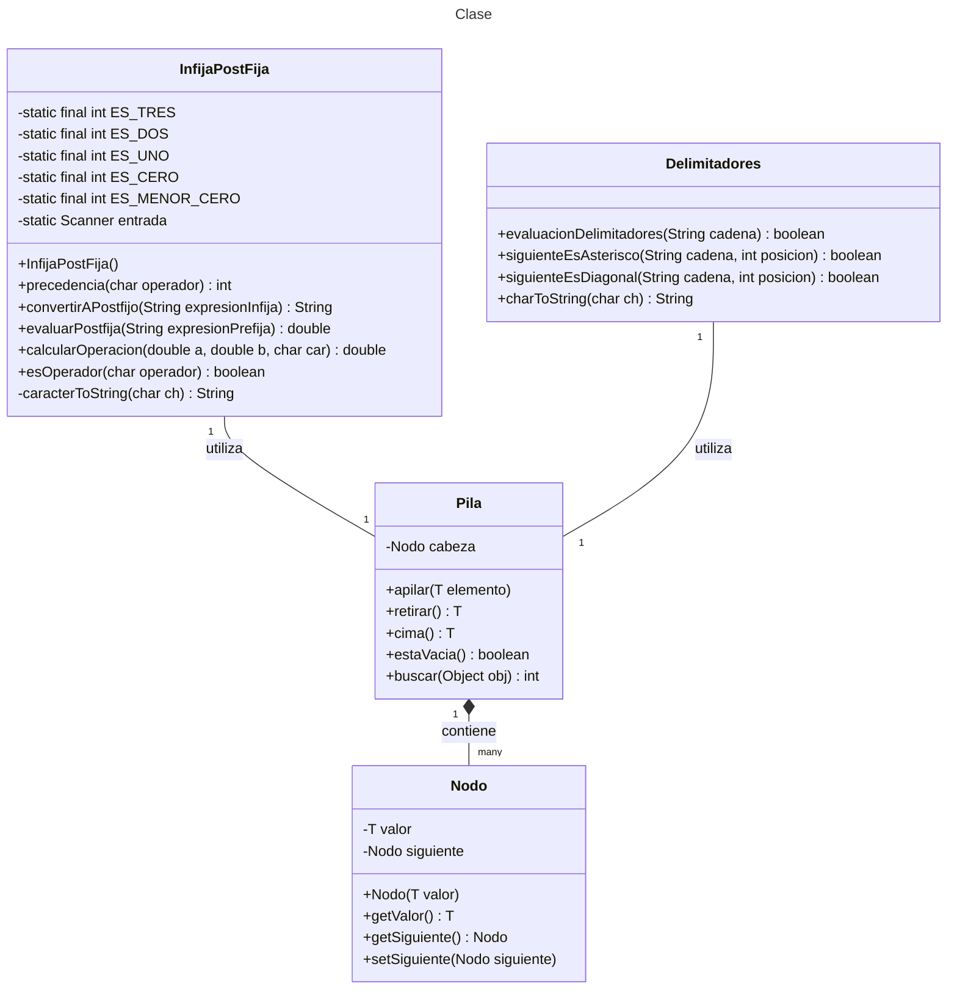

# Proyecto - Uso de la Estructura pila

El objetivo de este proyecto es proporcionar una implementación robusta y eficiente de la estructura de datos Pila, y demostrar su aplicación en la manipulación y evaluación de expresiones aritméticas. El proyecto incluye funcionalidades para convertir expresiones en notación infija a notación postfija, así como para evaluar dichas expresiones utilizando una pila.

### Objetivos Específicos

1. **Implementar la Estructura de Datos Pila**: Crear una clase `Pila` que soporte operaciones básicas como apilar, retirar, y buscar elementos.
2. **Conversión de Expresiones**: Desarrollar métodos para convertir expresiones aritméticas de notación infija a notación postfija y prefija.
3. **Evaluación de Expresiones**: Implementar métodos para evaluar expresiones aritméticas utilizando una pila.
4. **Verificación de Delimitadores**: Asegurar que las expresiones aritméticas estén correctamente balanceadas en términos de paréntesis, corchetes y llaves.
5. **Pruebas Unitarias**: Utilizar JUnit para crear pruebas unitarias que verifiquen la correcta funcionalidad de todas las partes del proyecto.
6. **Autograding**: Configurar el proyecto para utilizar Autograding, permitiendo la evaluación automática del código mediante pruebas unitarias.

### Importancia del Proyecto

Este proyecto es una excelente herramienta educativa para entender y aplicar la estructura de datos Pila en problemas reales. Además, proporciona una base sólida para proyectos más complejos que requieran manipulación y evaluación de expresiones aritméticas. La inclusión de pruebas unitarias y Autograding asegura que el código sea confiable y esté libre de errores, facilitando su mantenimiento y extensión.


### El proyecto está organizado en los siguientes paquetes:

**pila**: Contiene la implementación de la estructura de datos Pila.
**miPrincipal**: Contiene las clases principales que utilizan la pila para convertir y evaluar expresiones.
**miTest**: Contiene las pruebas unitarias para verificar la funcionalidad del proyecto.

## Requisitos
Java: Asegúrate de tener instalada la última versión de Java.
JUnit: Utilizado para las pruebas unitarias.

## Ejecución

Para ejecutar el proyecto, puedes utilizar Visual Studio Code. Asegúrate de tener configurado el entorno de desarrollo con JUnit para ejecutar las pruebas unitarias.

## Autograding
El proyecto está configurado para utilizar Autograding, lo que permite evaluar automáticamente el código mediante pruebas unitarias. Esto es útil para asegurar que todas las funcionalidades del proyecto funcionen correctamente antes de su entrega.

## Diagrama de clases
[Editor en línea](https://mermaid.live/)

[Referencia-Mermaid](https://mermaid.js.org/syntax/classDiagram.html)

## Diagrama de clases UML con draw.io
El repositorio está configurado para crear Diagramas de clases UML con ```draw.io```. Para usarlo simplemente agrega un archivo con extensión ```.drawio.png```, das doble clic sobre el mismo y se activará el editor ```draw.io``` incrustado en ```VSCode``` para edición. Asegúrate de agregar las formas UML en el menú de formas del lado izquierdo (opción ```+Más formas```).

## Uso del proyecto con make

### Default - Compilar+Probar+Ejecutar
```
make
```
### Compilar
```
make compile
```
### Probar todo
```
make test
```
### Ejecutar App
```
make run
```
### Limpiar binarios
```
make clean
```
## Comandos Git-Cambios y envío a Autograding

### Por cada cambio importante que haga, actualice su historia usando los comandos:
```
git add .
git commit -m "Descripción del cambio"
```
### Envíe sus actualizaciones a GitHub para Autograding con el comando:
```
git push origin main
```
## Comandos individuales
### Compilar

```
find ./ -type f -name "*.java" > compfiles.txt
javac -d build -cp lib/junit-platform-console-standalone-1.5.2.jar @compfiles.txt
```
Ejecutar ambos comandos en 1 sólo paso:

```
find ./ -type f -name "*.java" > compfiles.txt ; javac -d build -cp lib/junit-platform-console-standalone-1.5.2.jar @compfiles.txt
```


### Ejecutar Todas la pruebas locales de 1 Test Case

```
java -jar lib/junit-platform-console-standalone-1.5.2.jar -class-path build --select-class miTest.AppTest
```
### Ejecutar 1 prueba local de 1 Test Case

```
java -jar lib/junit-platform-console-standalone-1.5.2.jar -class-path build --select-method miTest.AppTest#appHasAGreeting
```
### Ejecutar App
```
java -cp build miPrincipal.Principal
```
Los comandos anteriores están considerados para un ambiente Linux. [Referencia.](https://www.baeldung.com/junit-run-from-command-line)
